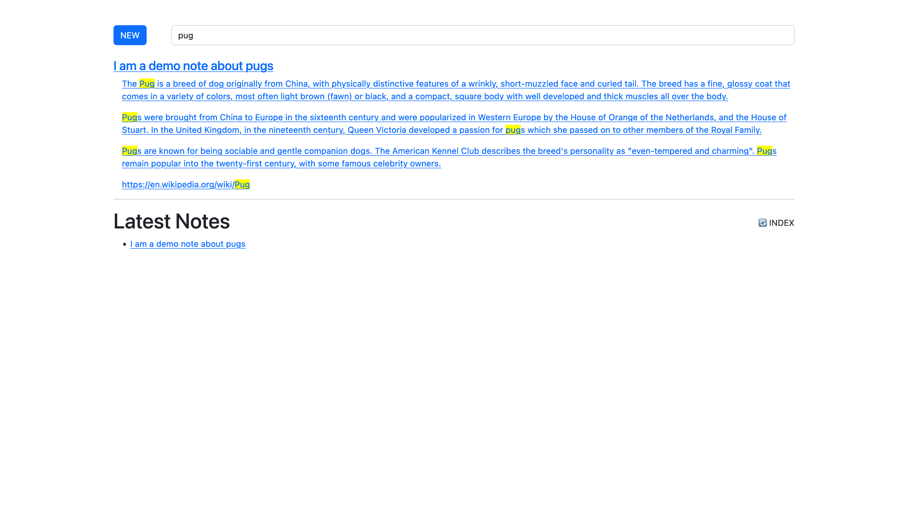
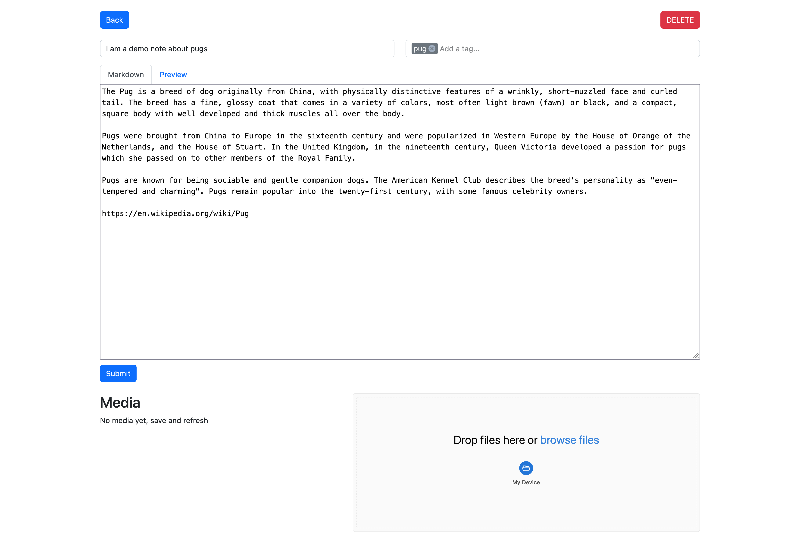
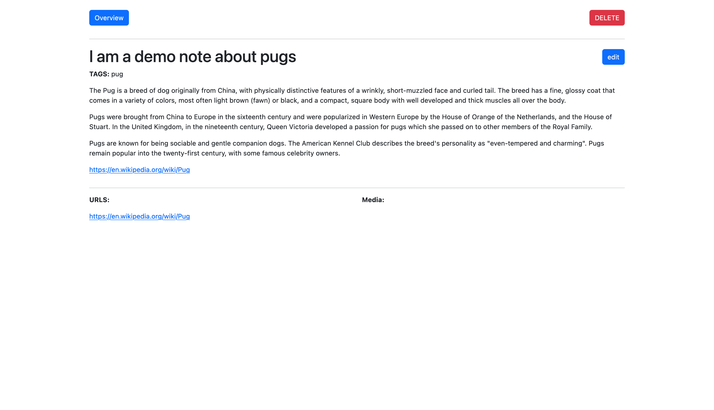

# Labradorite Notebook<!-- omit in toc -->

---

> [!NOTE]
> **Fast & Simple Search** - Powered by SQLite FTS5 with Extralite.
>
> ✅ **Pure Ruby + SQLite** solution - no external dependencies  
> ✅ **High performance** - SQLite FTS5 with BM25 ranking  
> ✅ **Simple deployment** - runs anywhere Ruby + SQLite work  
> ✅ **Flexible storage** - in-memory or file-based indexing  

---


> Labradorite rightfully belongs to the group of wisdom crystals, because it
> promotes a free flow of mental energy as it awakens intuition and allows us to
> get mentally unstuck.
>
> _\- every esoteric out there_

---

[](https://github.com/simonneutert/labradorite-notebook/actions/workflows/ruby.yml)

---

- [Rationale](#rationale)
- [Features / User Info](#features--user-info)
- [Technical Prerequisites](#technical-prerequisites)
- [Architecture](#architecture)
- [Folder Structure](#folder-structure)
- [Major Dependencies](#major-dependencies)
- [Run/Deploy with Docker](#rundeploy-with-docker)
  - [Docker Compose](#docker-compose)
- [Development](#development)
- [Run it](#run-it)
- [Follow-up: Inspiration, Knowledge](#follow-up-inspiration-knowledge)
    - [Tantiny](#tantiny)
    - [Rails Multi-Model Search](#rails-multi-model-search)

---

## Rationale

Most Notetaking apps do either too much (Notion), too little (Apple Notes) and
lock me in (all options ever).

I wanted something that does **just-enough**™, in the spirit of a _flat file
cms_. Let me try and wrap it up in a few bullets:

- **ownership** of the notes (flat files)\
  markdown, yaml, attachments all in one place in directories
- **easy** on the eyes/mind\
  I don't want to see all the old stuff I may not need anymore
- a search that shows me **snips** in the notes\
  not just the notes in a sidebar
- a very simple **tagging** support
- basic **file uploads**\
  keeping the originals side by side with notes

I like to keep things simple, so I once again fell for
[Roda](https://roda.jeremyevans.net) as the Web Layer.
SQLite FTS5 with [Extralite](https://github.com/digital-fabric/extralite) provides 
excellent full-text search without external dependencies.
Pure Ruby + SQLite = simple deployment anywhere!

---

## Features / User Info

**Search Engine**

- **SQLite FTS5** full-text search with BM25 ranking
- **In-memory database** by default for faster performance
- **Configurable storage**: Use `DATABASE_TYPE=file` for persistent search index
- **Multi-field search** across title, tags, and content
- **Smart snippets** showing matching content with context

**Markdown Editor**

- Preview
- Supports auto-formatting with/around saving (on page refresh)

**Attachments**

- supported attachments for uploads
  - txt
  - pdf
  - md
  - png
  - jpg
  - jpeg
  - heic
  - webp
  - yml
  - yaml
  - json
  - gpx

**Screenshots**



---



---



## Technical Prerequisites

- Ruby v3.4+ are tested and ready to roll
- SQLite3 (included with most systems)

## Architecture

Little experiment on how it rolls:

- all GET gets HTML
- all POST sends FORMS/JSON gets JSON back
- all links/navigation are plain HTML `a` tags 🤯

## Folder Structure

- `lib`: Library Code / Business Logic
  - `lib/search_index/`: SQLite FTS5 search implementation
- `views`: ERB Views
- `memos`: the Memos/Notes in subdirectories `YYYY/MM/DD/random-string`
- `public`: css/js/media
- `search_index.db`: SQLite FTS5 search index (optional, for persistent storage)

## Major Dependencies

- Roda
- Sequel + Extralite (SQLite FTS5)
- RedCarpet

## Run/Deploy with Docker

The included `Dockerfile` and the `docker-compose.yml` are more a stub to build
upon.

Currently the Dockerfile support passing the USERNAME as an `build-arg`.

- `$ docker build . --build-arg USERNAME=$(whoami) -t labba`
- `$ docker run --rm -p9292:9292 labba`

Either this way, or you adapt the Dockerfile to your needs.

Let's say your username on the server you run (or your machine) is `johndoe`,
then your Dockerfile should look something like this:

```Dockerfile
# in your version of the Dockerfile, replace labradorite at the ARG USERNAME
ARG USERNAME=johndoe
```

That will help you both secure the service and have the files being created with
the proper rights on the host system.

### Docker Compose

build and/or up using: `$ USERNAME=$(whoami) docker-compose build`

**Volumes**

- this `memos` directory has all your created content in it. Having it mounted
  from your host should make easy for you to backup (if you don't use a private
  gitrepo for that 😉)
- `search_index.db`: Only needed if using `DATABASE_TYPE=file` for persistent search index
- Note: The search index is rebuilt automatically from memo files on startup

## Development

The project now runs on any platform supporting Ruby + SQLite (Linux, macOS, Windows).
Docker deployment is still supported for convenience.

**Database Configuration**

- **Default**: In-memory database (faster, rebuilt on startup)
- **Persistent**: Set `DATABASE_TYPE=file` for file-based storage
- **Custom path**: Use `DATABASE_PATH=/custom/path.db` with file mode

**Testing**

- `$ rake test` runs the test suite
- `$ rake reset_default_memos` resets the files to the repos defaults (e.g. for testing)
- `$ rake reset_memos` clears ALL memos

Before pushing code, you should always run `rake reset` and `rake test`,\
**therefore have a repo you work on AND another you use JUST for running the
software.**

## Run it

Example docker-compose file:

```docker-compose
version: '3'
services:
  app:
    user: "${UID}:${GID}"
    environment:
      - USERNAME=yourusername # REPLACE THIS WITH YOUR VPS user's USERNAME
      - DATABASE_TYPE=file # Optional: use 'file' for persistent search index
    image: ghcr.io/simonneutert/labradorite-notebook:v0.2.0
    # ports:
    #  - 9292:9292
    command: bundle exec rackup -o0 -Eproduction
    volumes:
      - ./memos:/home/labradorite/memos:cached
      - ./search_index.db:/home/labradorite/search_index.db # Only if using DATABASE_TYPE=file
```

## Follow-up: Inspiration, Knowledge

#### SQLite FTS5

https://www.sqlite.org/fts5.html

#### Rails Multi-Model Search

https://stevepolito.design/blog/search-across-multiple-models-in-rails/

Gist: a searchable table is to be added and kept updated using commit_hooks
